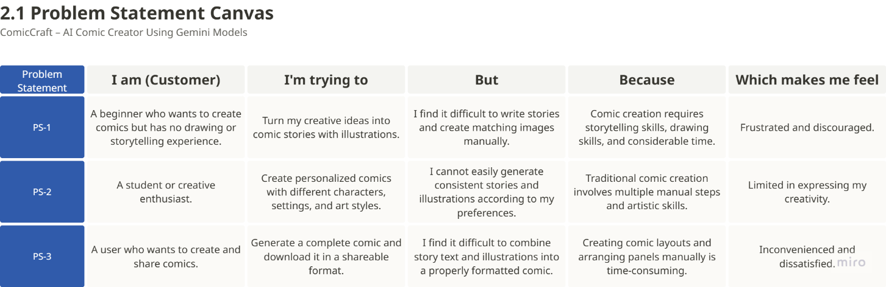

# 2.1 Problem Statement – ComicCraft

ComicCraft addresses the difficulty of creating a complete comic when a user has a story idea but does not have professional drawing, writing or comic-design skills.

The source document includes the following Problem Statement Canvas:

The canvas describes customer problems, needs, current difficulties and which tasks can be made easier through ComicCraft.
