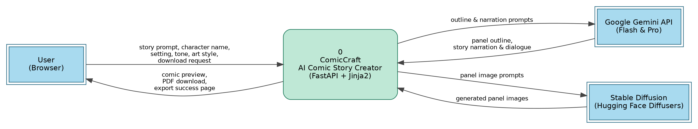
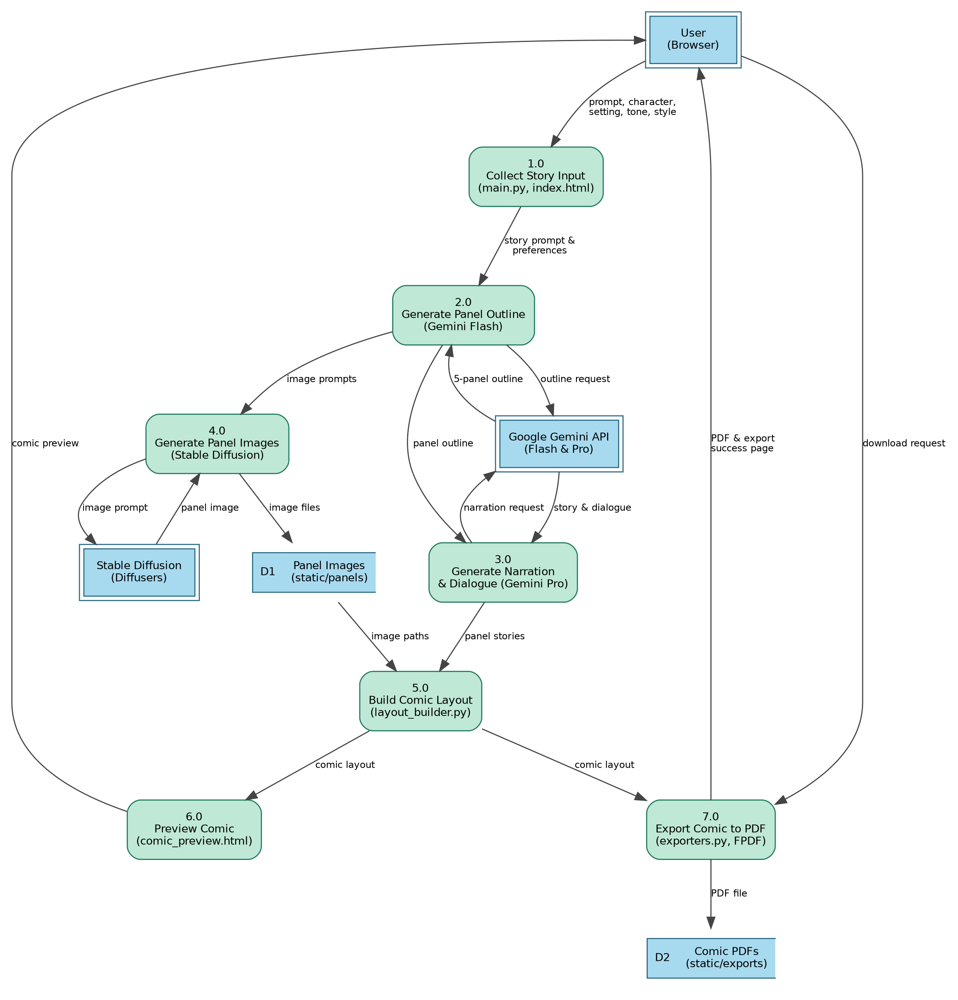

# 3.3 Data Flow Diagram and User Stories

## Data Flow Diagrams

A Data Flow Diagram (DFD) is a traditional visual representation of the information flows within a system. A neat and clear DFD can depict the right amount of the system requirement graphically. It shows how data enters and leaves the system, what changes the information, and where data is stored.

## DFD Level 0 – ComicCraft

ComicCraft is a web application built with FastAPI that turns a user's story prompt into a five-panel comic with illustrations using Gemini Flash, Gemini Pro and Stable Diffusion. At Level 0 the whole application is one process that exchanges data with three external entities.

- **User (Browser):** sends the story prompt, character name, setting, tone, art style and download request; receives the comic preview, PDF and export success page.
- **Google Gemini API:** receives outline and narration prompts; returns the panel outline and the story narration with dialogue.
- **Stable Diffusion (Diffusers):** receives panel image prompts; returns the generated panel images.

## DFD Level 1 – ComicCraft

1. User opens the ComicCraft web page and fills the form: story prompt, character name, setting, tone and art style.
2. FastAPI (`main.py`, `routes.py`) receives the form data through a POST request and renders pages with Jinja2 templates.
3. Gemini Flash generates a structured five-panel outline: panel number, title, scene description and an image prompt.
4. Gemini Pro expands the outline into narration and character dialogue for every panel.
5. Stable Diffusion (Hugging Face Diffusers) creates a comic-style image for each panel's image prompt. Images are saved in `static/panels` (D1).
6. `layout_builder.py` matches each image with its panel text and builds the comic layout.
7. `comic_preview.html` shows the comic panel by panel to the user.
8. On download, `exporters.py` compiles the layout into a PDF with FPDF, saves it with a timestamp in `static/exports` (D2) and redirects to `export_success.html`.

### Data Stores

- **D1 Panel Images:** generated panel images in `static/panels`.
- **D2 Comic PDFs:** exported comic PDFs in `static/exports`.

## User Stories

### Customer (Mobile User)

| Epic | User Story | Acceptance Criteria | Priority | Release |
|---|---|---|---|---|
| Story Input | USN-1: As a user, I can open the ComicCraft page in my phone browser and see the input form for story prompt, character name, setting, tone and art style. | The form loads and all five fields are usable on a mobile screen. | High | Sprint-1 |
| Story Input | USN-2: As a user, I can enter a story prompt describing my comic idea, such as “A brave fox exploring an enchanted forest”. | The prompt is submitted to the FastAPI backend. | High | Sprint-1 |
| Customization | USN-3: As a user, I can enter the main character's name and the setting (e.g. forest, school, city). | The name and setting appear in the generated outline and story. | High | Sprint-1 |
| Customization | USN-4: As a user, I can choose the story tone (e.g. dramatic, funny) and the art style (e.g. anime, comic book, realistic). | The story mood and images match the chosen tone and style. | Medium | Sprint-1 |
| Comic Generation | USN-5: As a user, I receive a structured five-panel comic outline generated from my prompt. | Each panel has a number, title, scene description and image prompt. | High | Sprint-1 |
| Comic Generation | USN-6: As a user, I receive narration and character dialogue for every panel. | Each panel has story text and dialogue. | High | Sprint-2 |
| Comic Generation | USN-7: As a user, I receive a comic-style illustration for every panel. | One image per panel is generated and saved. | High | Sprint-2 |
| Comic Preview | USN-8: As a user, I can preview the full comic on screen with each panel's image and text. | The preview page shows all panels in order. | High | Sprint-2 |
| Regeneration | USN-9: As a user, I can change the tone or art style and submit again to regenerate the whole comic. | A new outline, story and images are produced with the new settings. | Medium | Sprint-3 |
| Export | USN-10: As a user, I can download my comic as a PDF containing images and narration. | A PDF with a timestamped file name is downloaded. | High | Sprint-3 |
| Export | USN-11: As a user, I am taken to an export success page after downloading. | The success page confirms the export. | Medium | Sprint-3 |

### Customer (Web User)

| Epic | User Story | Acceptance Criteria | Priority | Release |
|---|---|---|---|---|
| Story Input & Preview | USN-12: As a web user, I can create, preview and export a comic using the website on my desktop browser. | The full flow from input form to PDF export works on desktop. | High | Sprint-2 |
| API Access | USN-13: As a web user, I can send a JSON request to the API endpoint and receive a generated comic. | The API returns the outline, story and image paths in JSON. | Medium | Sprint-3 |

### Customer Care Executive

| Epic | User Story | Acceptance Criteria | Priority | Release |
|---|---|---|---|---|
| Support | USN-14: As a customer care executive, I can use the image test route to check that panel images generate, so I can help users who report missing images. | The test route returns a generated image. | Medium | Sprint-3 |
| Support | USN-15: As a customer care executive, I can find a user's exported PDF by its timestamped name to help a user who lost a download. | The correct PDF is found in the exports folder. | Low | Sprint-3 |

### Administrator

| Epic | User Story | Acceptance Criteria | Priority | Release |
|---|---|---|---|---|
| Configuration | USN-16: As an administrator, I can configure the Gemini API key and the models (Gemini Flash, Gemini Pro, Stable Diffusion v1-5). | The app connects to all three models. | High | Sprint-1 |
| Deployment | USN-17: As an administrator, I can run the app locally with Uvicorn and test it at the home page and the `/docs` page. | The app starts and both pages open. | High | Sprint-1 |
| Maintenance | USN-18: As an administrator, I can review and clear generated files in `static/panels` and `static/exports`. | Old images and PDFs can be removed to free space. | Low | Sprint-3 |
