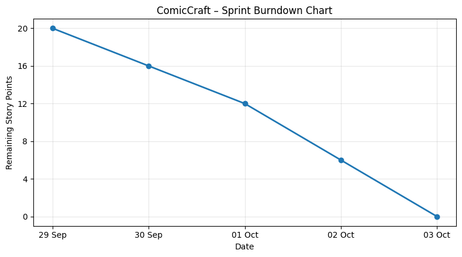

# 5.2 Project Tracker, Velocity and Burndown Chart

## Project Tracker

| Sprint | Total Story Points | Duration | Sprint Start Date | Sprint End Date (Planned) | Story Points Completed | Sprint Release Date (Actual) |
|---|---:|---|---|---|---:|---|
| Sprint-1 | 10 | 3 Days | 29 Sep 2026 | 01 Oct 2026 | 10 | 01 Oct 2026 |
| Sprint-2 | 10 | 2 Days | 02 Oct 2026 | 03 Oct 2026 | 10 | 03 Oct 2026 |

## Velocity

Total story points = 20.

Total project duration = 5 days.

Average velocity = 20 ÷ 5 = **4 story points/day**.

## Burndown Chart

## Team Responsibilities

| Team Member | Planned Responsibility |
|---|---|
| Yuvasri | Story generation, backend integration and testing |
| Vishrutha | AI/image generation and PDF export |
| Krishnapriya | Frontend, FastAPI integration and documentation |
| Dharshini | Frontend, comic preview and testing |
| Subasri | Project coordination, user input module and final integration |
